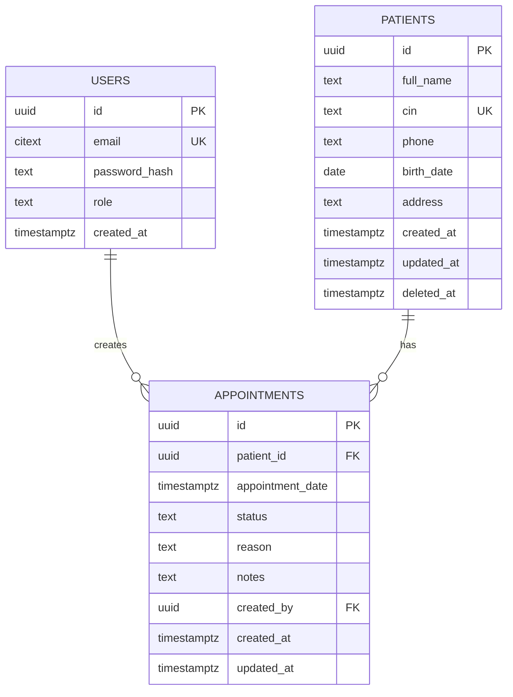

# Database design

One patient can have many appointments, while every appointment belongs to exactly one patient. One user can create many appointments, while every appointment has one creator. The supplied domain has no natural one-to-one or many-to-many relationship, so neither is invented.

Foreign keys use restrictive deletion to preserve clinical and audit history. Search indexes follow the API queries: normalized patient name/CIN, appointment date and status, and patient appointment history.
