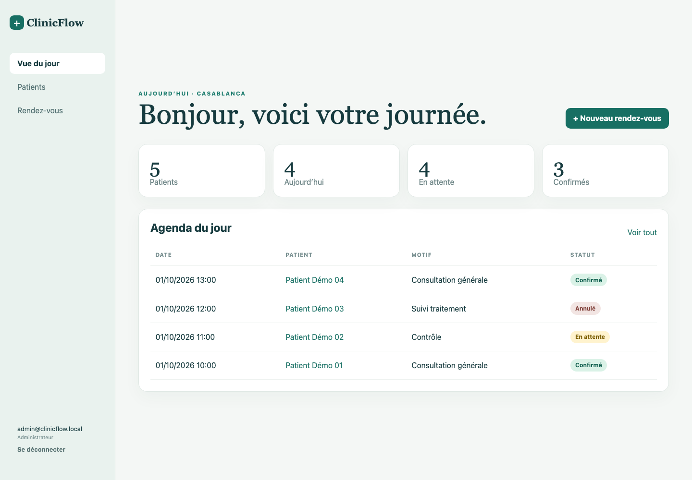
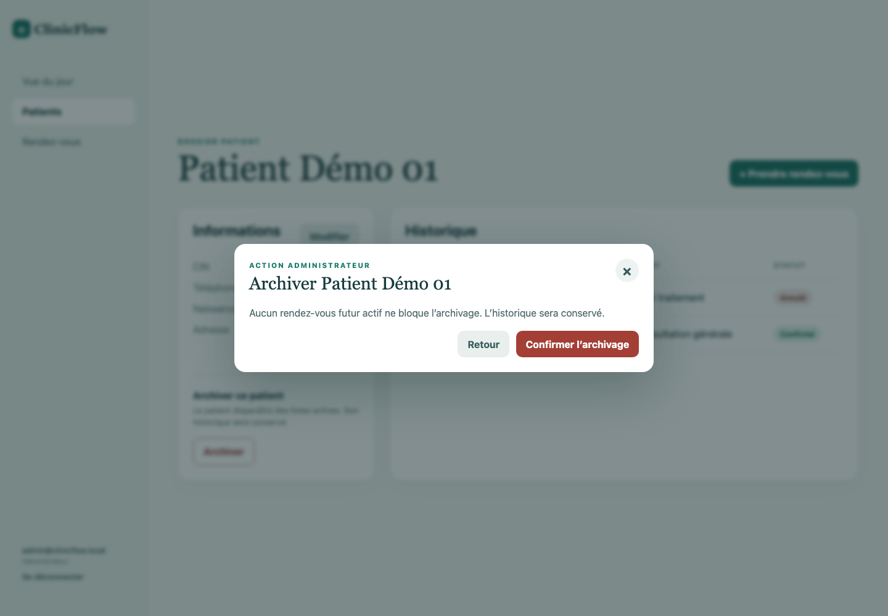
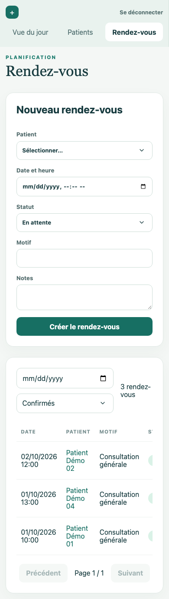

# ClinicFlow submission guide

## What to send

- Repository link with the default branch passing CI.
- Root `README.md` as the installation entry point.
- `docs/erd.md` and `docs/decisions.md` for design reasoning.
- `backend/openapi.yaml` for the API contract.
- The screenshots in `docs/screenshots`.

## Five-minute reviewer walkthrough

1. Run `docker compose up --build` and open `http://localhost:8088`.
2. Sign in as `admin@clinicflow.local` with `ClinicFlow2026!`.
3. Show the dashboard totals and today’s schedule.
4. Search for `DEMO-CIN-001`, open the record, and use **Prendre rendez-vous**.
5. Create and confirm an appointment, then attempt to confirm another one less than 30 minutes later. Explain that PostgreSQL enforces the rule atomically, including concurrent requests.
6. Return to the patient record and open the archive dialog. Cancel future appointments inside the dialog, then archive the patient.
7. Sign in as staff and show that archive controls are absent and the API also rejects the operation.
8. Point to the CI workflow, integration suite, Playwright workflow, health checks, OpenAPI contract, ERD, and audit log.

## Technical points to discuss

- The exclusion constraint is the final authority for the 30-minute scheduling rule. An API-only availability check would have a race condition.
- Patient deletion is a soft archive. Appointments and audit history remain intact.
- JWTs are stored in HttpOnly cookies and state-changing cookie requests require a CSRF token.
- Search, list, and appointment queries are indexed and paginated.
- Clinic calendar calculations consistently use `Africa/Casablanca`.
- The production Docker path uses same-origin Nginx proxying and health-gated startup.

## Screenshots

## Verification evidence

| Layer | Command | Coverage |
| --- | --- | --- |
| Types | `npm run typecheck` | Backend and frontend TypeScript |
| Build | `npm run build` | Production backend and Vite bundles |
| API/database | `npm test` | Auth, validation, roles, archival, dashboard, concurrent scheduling |
| Browser | `npm run test:e2e` | Admin workflow, role UI, mobile usability |
| Containers | `docker compose up --build` | PostgreSQL, migration/seed job, API, Nginx frontend |

## Before sending

- Confirm `git status` is clean.
- Confirm all four verification commands pass.
- Confirm `docker compose ps` reports PostgreSQL, backend, and frontend as healthy.
- Replace the Docker demo JWT secret for any public deployment.
- Keep the supplied demo accounts limited to local or assessment use.
